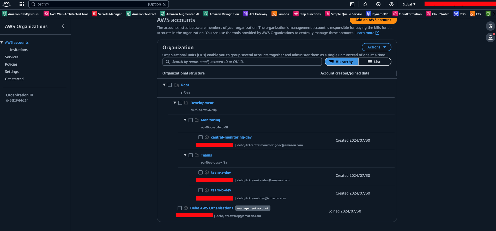
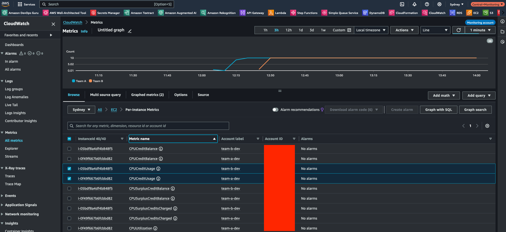
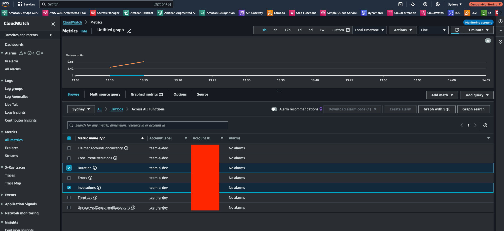

# AWS CloudWatch Central Observability Setup with Terraform

This project showcases how to set up Central Monitoring Account in AWS CloudWatch with Terraform.

**NOTE:** The current setup uses Observability Access Manager (OAM) and is limited to a single `region` (multiple account). This setup needs to be run once for each `region` if your workloads run in multiple region. For cross-region dashboards please refer the [documentation](https://docs.aws.amazon.com/AmazonCloudWatch/latest/monitoring/CloudWatch-Cross-Account-Methods.html).

## AWS Organisation Structure

**NOTE:** The project assumes that AWS Organisations is already setup



## Setting up the Monitoring Account

Monitoring Account is the `sink` for all telemetry data. The `terraform` project sets up the `sink`.

### Assuming the role for Central Monitoring Account

**NOTE:** This script needs to be run from the `Management Account`

```shell
source ./scripts/assume-role.sh -r <role_arn> -n "monitoring-account"
```

`role_arn` : ARN of the `Role` that `Management Account` can assume in the `Monitoring Account` (**For Example:** `arn:aws:iam::011528XXXXXX:role/OrganizationAccountAccessRole`)

### Setting up the Infra for Central Monitoring Account

```shell
terraform apply -var "region=<aws_region>" -var 'aws_org_paths=[<Org_Path>]'
```

`aws_org_paths` : Specify the hierarchy of the AWS Organisation. Please refer to [documentation](https://docs.aws.amazon.com/IAM/latest/UserGuide/access_policies_access-advisor-view-data-orgs.html#access_policies_access-advisor-viewing-orgs-entity-path) (**For Example:** `o-3tk3yl4o3r/r-f0oo/ou-f0oo-wnv67rip/ou-f0oo-ubspkf3a/*`)

## Setting up the Source Accounts

**NOTE:** This needs to be run for each **Source Account**. It is recommended to make this part of the `Account Provisioning` template.

### Assuming the role for Source Account

**NOTE:** This script needs to be run from the `Management Account`

```shell
source ./scripts/assume-role.sh -r <role_arn> -n "team-account"
```

`role_arn` : ARN of the `Role` that `Management Account` can assume in the `Source Account` (**For Example:** `arn:aws:iam::011528XXXXXX:role/OrganizationAccountAccessRole`)

### Setting up the Infra for Source Account

```shell
terraform apply -var "region=<aws_region>" -var "monitoring_account_id=<monitoring_account_id>" -var "central_sink_identifier=<arn_of_central_sink_identifier>"
```

`monitoring_account_id` : Account ID of the Monitoring Account
`central_sink_identifier` : ARN of the Central Sink. This is one of the output of the `Monitoring Account` stack. (**For Example:** `arn:aws:oam:ap-southeast-2:011528XXXXXX:sink/c13091ff-2e28-4588-91ce-8213ee1a81b5`)

## Viewing Metrics in the Central Monitoring Account

Once the setup is complete, you can log in to the `Central Monitoring Account` to view aggregated metrics.

### EC2 Metrics from Multiple Accounts



### Lambda Metrics from Single Account


